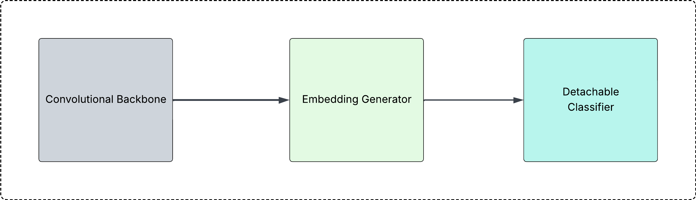
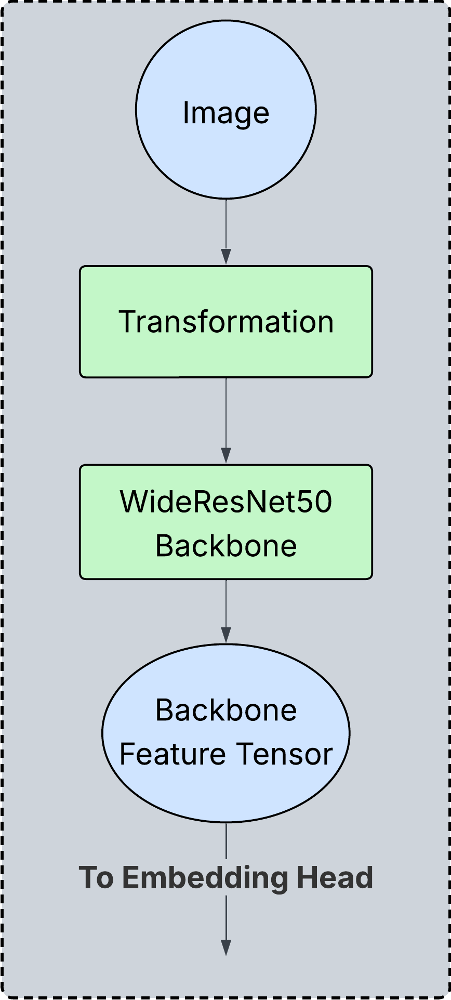
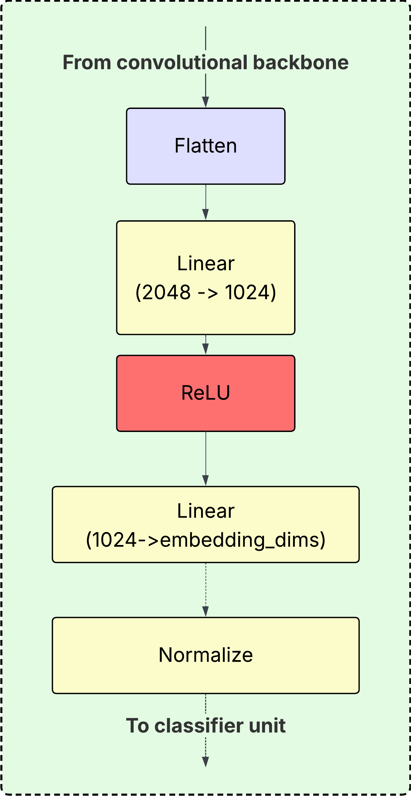
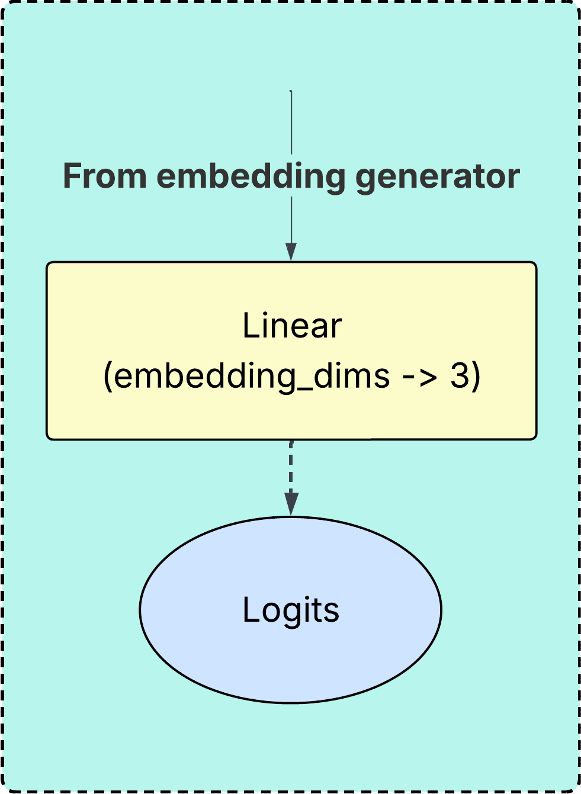
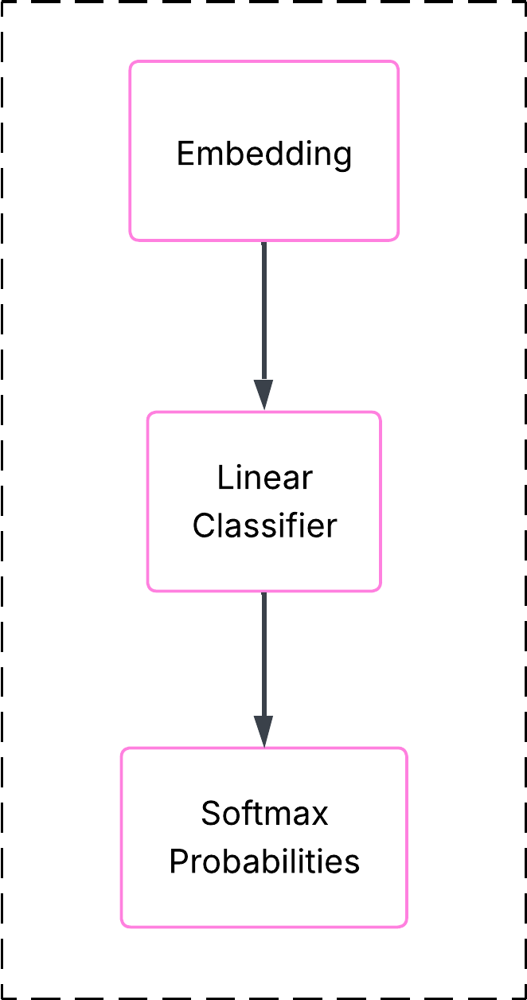
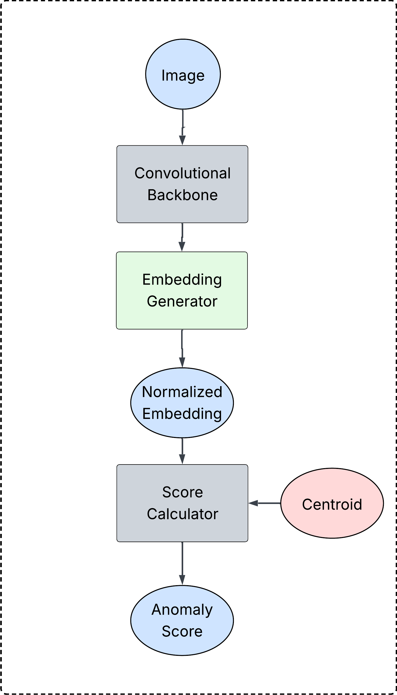
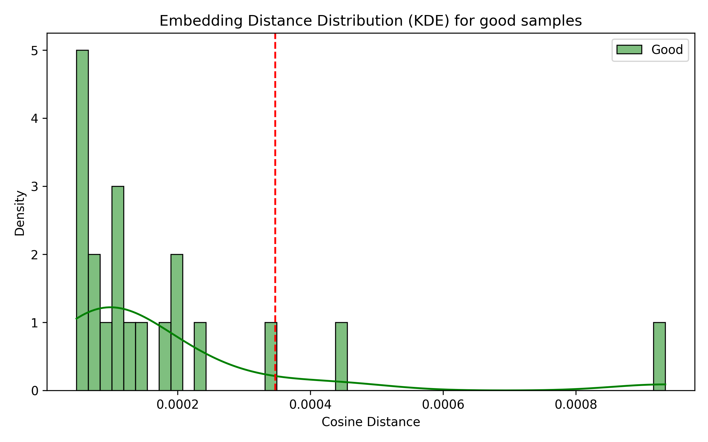
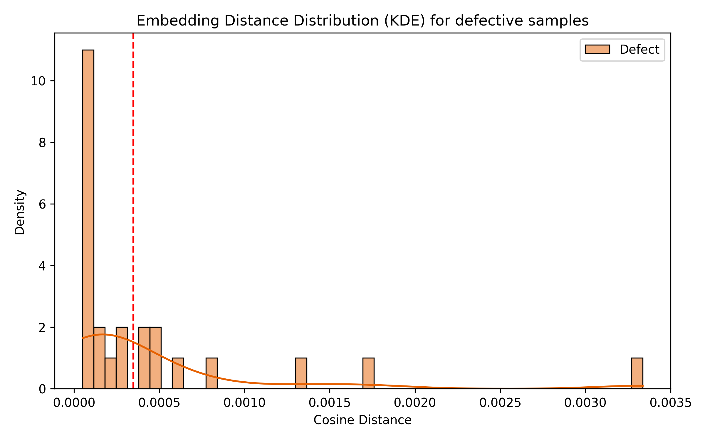
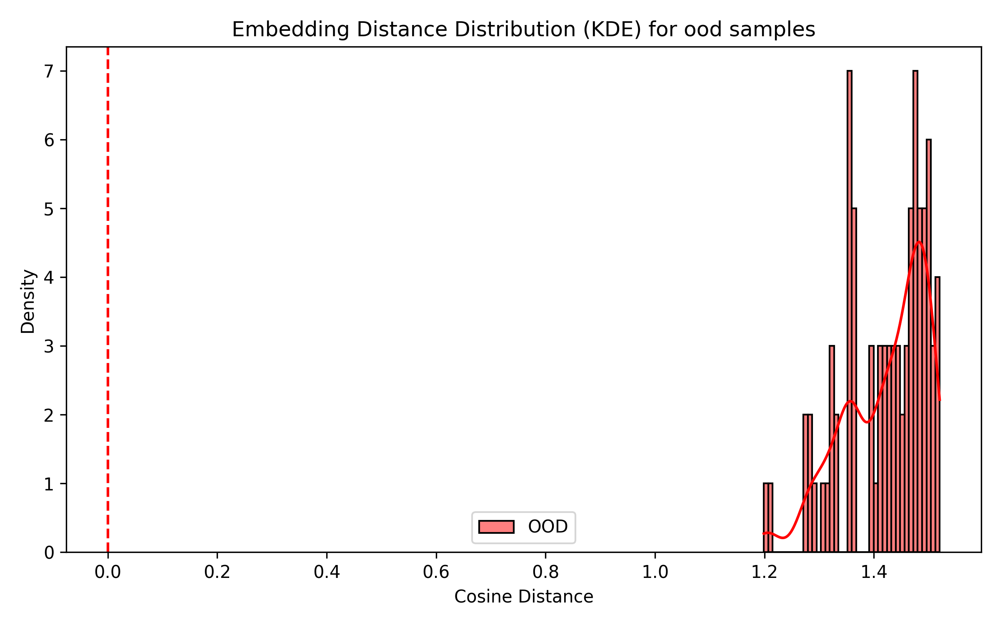
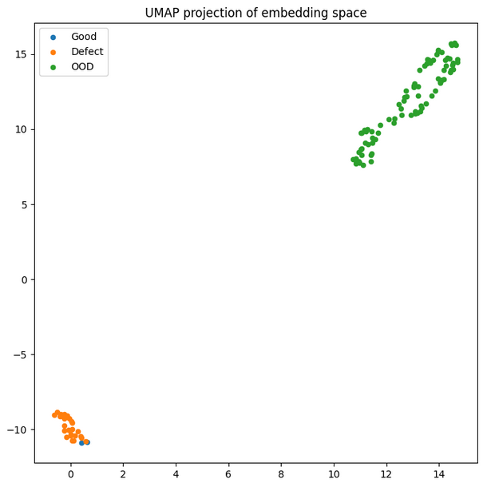

# Siamese-Based Representational Learning on MVTec Metal Nut

This project uses the **MVTec AD Dataset** for **learning a discriminative representation** of object images in high-dimensional **embedding space** using deep neural architecture.

The model learns a **feature embedding space** with a natural clustering of normal samples and deviated anomalous or OOD samples.

The anomaly score is computed as the **cosine distance from the centroid** of normal embeddings.

---

# Problem Statement

Industrial visual inspection often requires detecting subtle defects such as:

- scratches
- dents
- structural deformation

Traditional classification systems require every anomaly type to be labeled beforehand.  
However, in real-world manufacturing environments new defects can appear that were never seen during training.

This project instead learns a **representation of normal objects**, allowing anomalies to be detected as deviations from that learned structure.

---

# Dataset

The system uses the **MVTec Anomaly Detection Dataset**, a widely used benchmark for industrial inspection tasks.

Dataset structure:

```
mvtec/
 ├── metal_nut/
 │    ├── train/
 │    │    └── good
 │    └── test/
 │         ├── good
 │         ├── scratch
 │         ├── bent
 │         ├── hole
 │         └── other defect types
 ├── bottle/
 ├── cable/
 ├── capsule/
 └── other categories
```

For the purpose of the project, a separate Dataset class had to be generated along with associated type-labeling: 

| Label | Description                       |
| ----- | --------------------------------- |
| 0     | Good metal nuts                   |
| 1     | Defective metal nuts              |
| 2     | Out-of-distribution objects (OOD) |

OOD samples are drawn from other categories in the MVTec dataset such as **bottle**, **cable**, and **capsule**.

## Train-Val Split

Complete dataset is virtually split into **training** and **validation** sets with **split-ratio** set to **0.8**.

---

# Method Overview

The system learns a feature embedding using a convolutional neural network.

```
image
  │
  ▼
CNN encoder
  │
  ▼
embedding vector
  │
  ▼
centroid of normal samples
  │
  ▼
cosine distance anomaly score
```

The objective is to learn an embedding space where:

```
normal samples → tight cluster
defective samples → small deviations
OOD objects → distant regions
```

---

# Model Architecture

The model components can be divided into **three** stages, each with their own set of inputs and modules:

1. Convolutional Backbone

2. Embedding Generator

3. Classifier Head



### Convolutional Backbone



- **Input:** Raw Image file

- **Operation:** Applies **transformation** to **generate tensor**; runs the tensor through **WideResNet50 backbone**, thus generating a **Backbone Feature Tensor**.

- **Output:** Tensor object of shape (2048, 1, 1).

- **Parameters:** Locked, not-trainable. 

### Embedding Generator



- **Input:** Tensor (2048, 1, 1) object from **Convolutional Backbone.**

- **Operation:** **Flatten** the tensor to (2048), perform a dense layer **Linear(2048 -> 1024)**, add **ReLU** activation, then another **Linear(1024 -> embedding_dims)** operation followed by **normalization**.

- **Output:** Normalized Tensor of shape (1, embedding_dims).

- **Parameters:** All parameters are trainable.

### Classifier Head (Training Only)



- **Input:** Tensor (embedding_dims) from **Embedding Generator**.

- **Operation:** Performs a **Linear(embedding_dims -> 3)** to generate logits for the three cases of (Good Metal Nut, Defective Metal Nut, OOD).

- **Output:** A (1, 3) tensor that has the logits for **CrossEntropyLoss**.

- **Parameters:** All trainable parameters.

- Active during training, removed at inference.

---

# Training Strategy

During training the model is used as a **standard classifier**.



The classifier is trained using **cross-entropy loss**.

Although the classifier is used during training, it is **removed during inference**. This leaves only the encoding generator to be used later to obtain embeddings.

This approach allows the model to learn a structured embedding space while still benefiting from supervised labels.

---

# Data Augmentation

To improve generalization, strong augmentations are applied during training.

Examples include:

- random resized cropping
- random rotations
- horizontal and vertical flips
- brightness and contrast jitter
- Gaussian blur

These augmentations encourage the model to learn **invariant features** rather than memorizing individual training images.

---

# Centroid-Based Anomaly Detection

After training, the classification head is discarded.

The anomaly detection pipeline becomes:



**Anomaly score** is calculated relative to a **centroid**. Products may be classified based on the  anomaly score, or the embeddings may be used in general to perform other analysis.

## Inference Procedure

1. Pass image through encoder to obtain normalized embedding $\bold{z}$.

2. Compute cosine distance $d$ from the stored centroid $\bold{c}$.

3. Compare distance against stored thresholds for normal ($t_{n}$) and defective ($t_{def}$) distributions.

If $d < t_n:$ normal

else if $t_n < d < t_{def}:$ defective

else if $t_{def} < d:$ out-of-distribution.

## Centroid Computation

The centroid of normal samples is computed as:

$$
centroid = \frac{1}{N}\sum_{i=1}^{N}{F(x^{(i)})}
$$

where $F(x)$ is the mapping from **images** to **normalized embedding space** learned by the network. It is then **normalized**.

## Anomaly Score

For a test image:

$$
score(\bold{z}, \bold{c}) = 1 - \frac{\bold{z} \cdot \bold{c}}{\vert\vert \bold{z}\vert\vert \  \vert\vert  \bold{c}\vert\vert}
$$

Technically, this `score = 1 - cosine_similarity(z,c)`, where **z** is the embedding and **c** is centroid;  as the **z** and **c** are normalized , this reduces to  $1 - \bold{z}\cdot\bold{c}$

**Interpretation:**

| Score    | Meaning                    |
| -------- | -------------------------- |
| small    | normal sample              |
| moderate | defective sample           |
| large    | out-of-distribution object |

---

# Results

## Statistics on Observed Cosine Distance

|                        | Normal       | Defective | OOD      |
|:----------------------:|:------------:|:---------:|:--------:|
| **Mean**               | 2.172589e-05 | 0.000455  | 1.420922 |
| **Standard Deviation** | 4.214685e-08 | 0.000729  | 0.076480 |
| **Min**                | 2.169609e-05 | 0.000050  | 1.198767 |
| **Max**                | 2.175570e-05 | 0.003337  | 1.520178 |

The model effectively learns a **"normality direction"** in embedding space, 
with anomaly detection performed as angular deviation from this learned direction.

## Distribution Plots

Due to the different scales between in-distribution and out-of-distribution samples, 
we have to visualize them separately to highlight both fine-grained anomaly detection and large-scale semantic separation.

The vertical line marks the threshold of **95-th percentile** of good sample distribution.

  



## Interpretation

- normal samples form a very tight cluster

- defects lie slightly outside the cluster

- OOD objects are extremely far away

This effectively reduces anomaly detection to measuring angular deviation
from a learned representation of normality.

---

# Embedding Visualization

To visualize the learned representation, embeddings were projected into two dimensions using **UMAP**.

The resulting geometry reveals:

```
tight cluster of normal samples
nearby deviations for defects
distant clusters for unrelated objects
```

---

## UMAP Visualization



---


# Key Observations

### 1. Normal samples form a tight manifold

The model learns a compact representation of normal metal nuts.

### 2. Defects remain close to normal samples

Defective nuts are still visually similar to normal ones, so they appear as **small deviations rather than separate clusters**.

### 3. OOD samples are strongly separated

Objects from other categories occupy distant regions of the embedding space, making them easy to detect.

---

# Evaluation

The anomaly score provides a continuous measure of abnormality.

Typical ordering:

$d(normal) < d(defective) \ll d(ood)$

where $d(x)$ is the **average distance of class x from centroid**.

This allows the detector to identify both subtle defects and completely unrelated objects.

---

# Limitations

While the project shows good scores and clustering, it is sensitive to domain shifts. It may mark images from largely different distributions as anomalous.

---

# Technologies Used

- PyTorch
- Torchvision
- NumPy
- UMAP
- Matplotlib

---

# Repository Structure

```
ProdCheck/
 ├── datasets/
 │     ├── dataset.py
 │     └── transforms.py
 |
 ├── models/
 │     └── encoder.py
 │
 ├── training/
 │     ├── trainModel.py
 │     └── hyperparameters.py
 |     └── earlyStopping.py
 |
 ├── evaluation/
 │     ├── centroid.pt
 │     └── testModel.py
 │
 ├── data/
 |     ├── centroid.pt
 |     └── checkpoint.pt
 |
 ├── visualization/
 │     └── umap_visualization.py
 │
 └── README.md
```

---

# Future Work

Possible extensions include:

- patch-level anomaly localization
- self-supervised contrastive pre-training
- transformer-based feature encoders
- real-time industrial deployment

---

# Conclusion

This project demonstrates that **learning a robust embedding space** enables effective anomaly detection without explicitly modeling every possible defect.

By combining a pre-trained CNN encoder with a simple centroid-based scoring method, the system successfully separates:

- Normal Objects

- Defective Samples

- Out-of-distribution objects

This representation-based approach provides a flexible foundation for industrial visual inspection systems.
